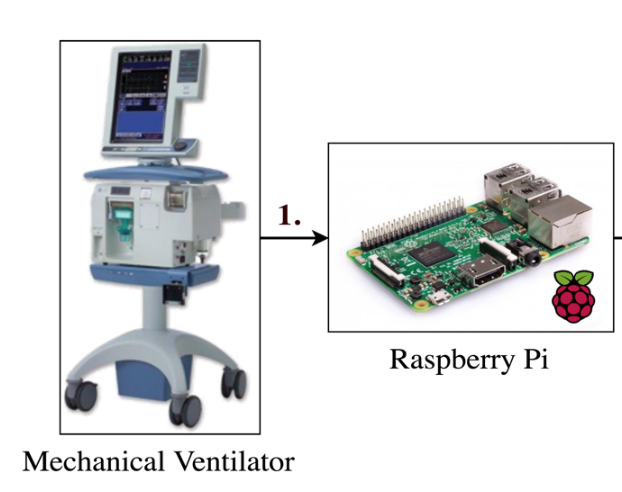

## Portfolio

---

### Machine Learning Projects

[Deep Learning For ARDS Detection with Ventilator Waveform Data](https://github.com/hahnicity/deepards)

---
[Classical Machine Learning for ARDS Detection with Ventilator Waveform Data](https://github.com/hahnicity/ardsdetection)

---
[Ventilator Mode Detection With Classical and Deep Learning](https://github.com/hahnicity/ventmode)

---
[Ventilator Asynchrony Detection With Classical ML](https://github.com/hahnicity/ucdpv_pva_ml)

---
[Deep Learning For Chest X-Ray14](https://github.com/hahnicity/ucd-cxr)

---

### Data Gathering and Visualization Work

[Common Scientific Code for Ventilator Analysis (VentMAP)](https://github.com/hahnicity/ventmap)

---

[Annotation Pipeline (APL) for Ventilator Data](https://github.com/hahnicity/apl)

---
[Tooling for Gathering, Transferring, and Storing Mechanical Ventilator Data](https://github.com/hahnicity/ucdpv_vent_infrastructure)

---

[Lung Segmentation using Deep Learning](https://github.com/hahnicity/pytorch-lung-segmentation)

---
---

Page template forked from <a href="https://github.com/evanca/quick-portfolio">evanca</a>

